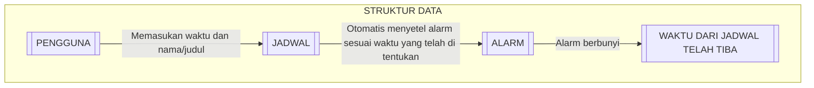

# 1.1) Latar Belakang 
Latar belakang dari pembuatan aplikasi saya ini, bertujuan untuk mengingatkan pengguna jika di waktu yang telah pengguna tentukan terdapat jadwal yang perlu di kerjakan atau di hadiri. Dan untuk kedepannya saya memiliki rencana mengembangkan aplikasi ini hingga bisa menampilkan jadwal yang telah di buat di tampilkan di layar depan tanpa harus membuka aplikasi. juga dapat mengirim pengingat di beberapa perangkat asalkan setiap perangkat login menggunakan akun yang sama. Bahkan saya ingin mengembangkannya lebih jauh hingga tingkatan dimana aplikasi saya ini, dapat memesankan sesuatu seperti ojek online atau sejenisnya secara otomatis pada saat jadwal yang telah di tentukan pengguna telah tiba. Ini bertujuan untuk menghemat waktu dari pengguna.

_illustration about bussy time;_

# 1.2) Deskripsi 
"Rem'YS" adalah nama aplikasi yang sedang saya kerjakan, "Rem'YS" sendiri memiliki arti "Remember Your Scedule" nama yang cukup Random bukan :v. Ya, saya memang menamai aplikasi ini secara random, tetapi tetap memiliki hubungan dengan kegunaan dari aplikasi ini. Yaitu, untuk mengingatkan jadwal/kegiatan yang harus di kerjakan/dilakukan oleh pengguna. Pengguna bisa mengatur jadwal yang akan, ingin atau harus dilakukan, baik itu hanya sekali, harian, bulanan atupun tahunan sesuai keinginan dari pengguna. Bahkan pengguna dapat memasang pengingat di beberapa perangkat dengan syarat harus login di semua perangkat yang ingin pengguna pasangkan pengingat. Dengan antarmuka yang simple dan penuh petunjuk, diharapkan aplikasi ini dapat dengan mudah di gunakan oleh semua kalangan, mulai dari pelajar sampai orang tua, untuk mengingatkan waktu, kegiatan, pertemuan atau bahkan momen yang tak ingin di lewatkan. Adapun fitur yang menurut saya cukup penting, yaitu fitur _Widget_. Fitur Widget adalah fitur dimana jadwal yang ada didalam aplikasi bisa di tampilkan di layar depan, jadi tidak perlu membuka aplikasi jika hanya ingin melihat jadwal yang telah di buat. 

# 1.3) Branding 
- Merk : Rem'YS
- Tagline : Don't let your scedule run away!
- Campaign : Membuat aplikasi yang dapat mengingatkan agenda dari pengguna secara efektif, sehingga pengguna tidak melewatkan agendanya.
- Target user : pelajar, pekerja kantoran dan pembisnis yang memiliki banyak agenda rapat, mahasiswa untuk mengatur jadwal kelas dan sejenisnya.
- User experience theme : Memiliki petunjuk penggunaan aplikasi dan antarmuka yang tidak terlalu ribet dan berdempetan untuk mempermudah pengguna menggunakannya. Menggunakan warna yang lumayan mencolok untuk mepermudah pengguna menggunakan aplikasi.
- _contoh:_ 
 


# 2) User Story

Prioritas ke- | Keinginan penguna | Tujuan
---|---|---
1 | Menambahkan jadwal mulai dari jam, hari, tanggal, bulan sampai tahun.| sebagai penanda ada jadwal pada waktu tersebut.
2 | Dapat menambahkan nama atau judul dari jadwal yang di buat | Supaya tahu jenis kegiatan apa yang ada pada jadwal tersebut.
3 | Dapat melihat jadwal yang telah di buat | Agar dapat melihat jadwal yang ada dan memastikan jadwal yang telah di buat benar
4 | Mendapat alarm pengingat bahwa ada jadwal pada waktu yang telah di tetapkan | Mengingatkan bahwa ada jadwal pada waktu tersebut.
5 | Dapat melihat jadwal di layar depan tanpa perlu mebuka aplikasi | Mempermudah dan menghemat waktu dalam melihat jadwal.

# 3) Struktur Data


# 4) Arsitektur Sistem
 
 ```mermaid
flowchart TD
subgraph ARSITEKTUR SISTEM
    D1[(DATABASE : SQLite)] <--> B2{{BACKEND : KOTLIN - ANDROID ARCHITECTURE COMPONENT}} <--> A3[/APLIKASI ANDROID - KOTLIN\]
end
```
# 5) Teknologi, Library, dan Framework


